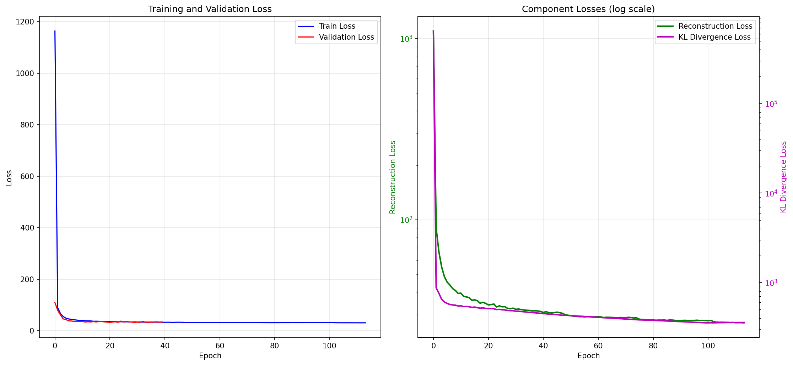
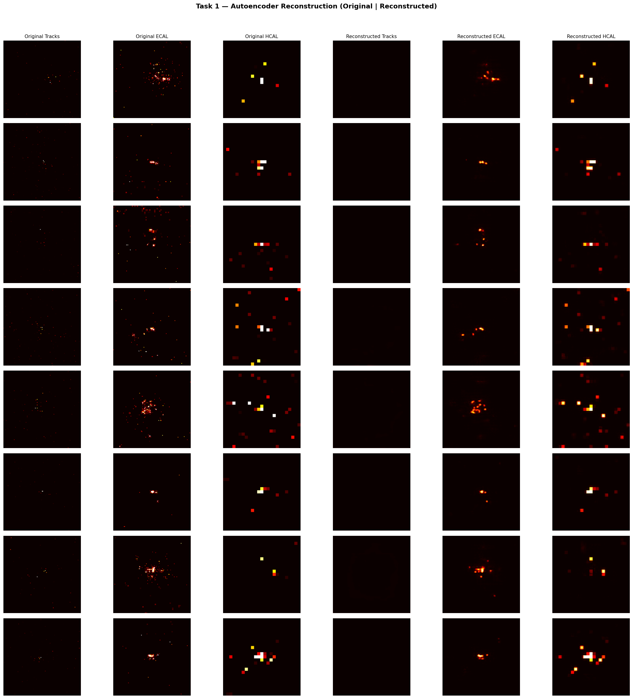
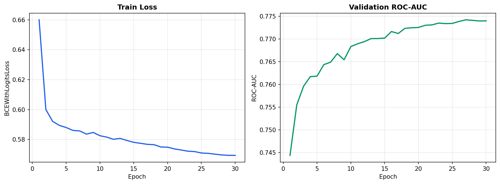
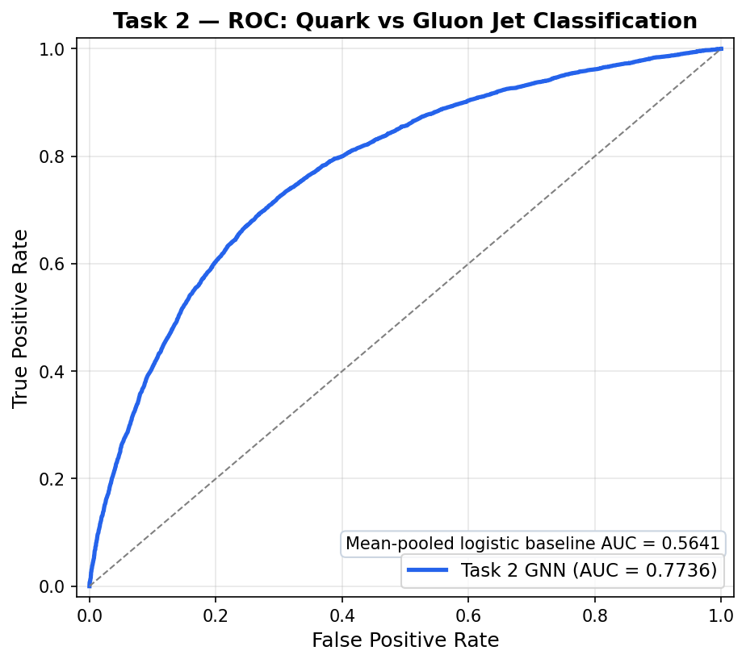
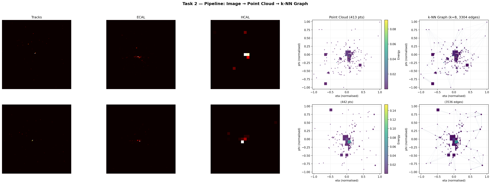
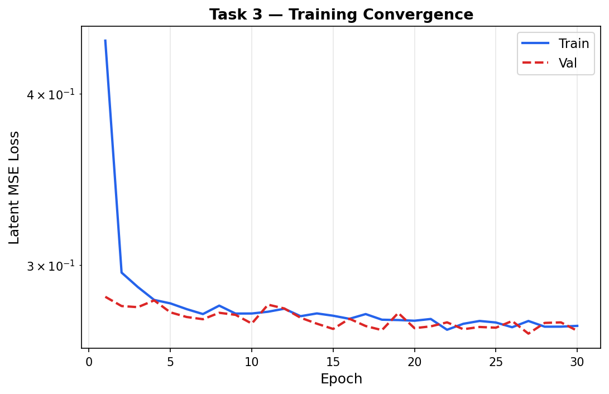
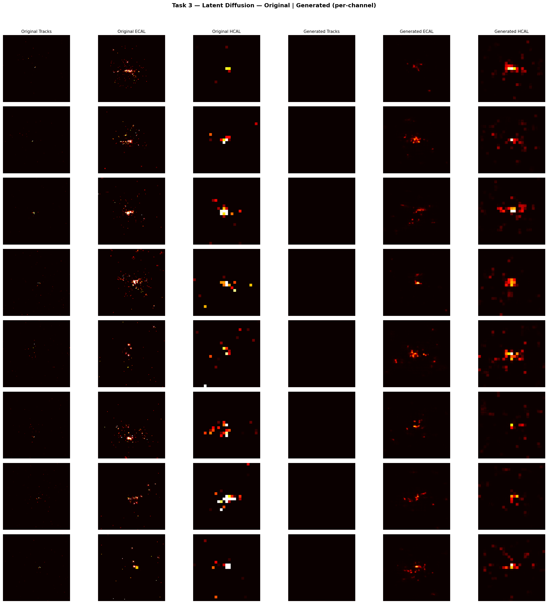

# GENIE — Learning Latent Structure with Diffusion Models

> **ML4SCI GSoC 2026 Evaluation** · Quark/Gluon Jet Generation & Classification  
> *Applicant: Nitik Jain · Organization: [ML4SCI](https://ml4sci.org/)*

---

## Results at a Glance

| Task | Model | Key Metric | Value |
|------|-------|------------|-------|
| **Task 1** — Reconstruction | Convolutional VAE | PSNR / SSIM | **37.93 dB / 0.967** |
| **Task 2** — Classification | GraphSAGE (k-NN) | ROC-AUC / Accuracy | **0.774 / 70.6%** |
| **Task 3** — Generation | Latent Diffusion (DDPM) | PSNR / SSIM | **30.32 dB / 0.931** |

---

## Dataset

The [Quark/Gluon Jet Dataset](https://cernbox.cern.ch/index.php/s/b5WrtcHe0xQ26M4) contains **139,306** calorimeter images of simulated jet events from proton-proton collisions. Each sample is a `125 × 125 × 3` image representing energy deposits across three detector subsystems:

| Channel | Detector | Description |
|---------|----------|-------------|
| 0 | **Tracks** | Charged particle trajectories; extremely sparse (< 0.1% nonzero) |
| 1 | **ECAL** | Electromagnetic calorimeter; captures electron/photon showers |
| 2 | **HCAL** | Hadronic calorimeter; captures hadron energy deposits |

**Key property — sparsity:** On average, only ~0.06% of pixels are nonzero in any given image. This extreme sparsity is a defining challenge: standard image models (CNNs, diffusion) must learn to reconstruct mostly-empty images with sharp, localized energy clusters. This motivates the graph-based representation in Task 2 and the latent-space approach in Task 3.

---

## Metrics

| Metric | Definition | Relevance |
|--------|-----------|-----------|
| **MSE** | Mean squared error over all pixels | Overall reconstruction fidelity |
| **Nonzero MSE** | MSE computed only on active detector cells | Physics-critical: measures accuracy on the signal, ignoring background |
| **PSNR** (dB) | Peak signal-to-noise ratio (higher = better) | Standard image quality metric; above ~30 dB is considered good |
| **SSIM** | Structural similarity index [0, 1] | Captures perceptual similarity beyond pixel-level error |
| **Active IoU** | Intersection over union of nonzero pixels | Binary accuracy of detecting active vs. inactive cells |
| **ROC-AUC** | Area under the receiver operating characteristic | Classification discrimination power; 0.5 = random, 1.0 = perfect |
| **Active Density** | Fraction of nonzero pixels in generated vs. real images | Validates that generated jets match real sparsity patterns |

---

## Task 1 — Variational Autoencoder

### Objective

Learn a compact 256-dimensional latent representation of 3-channel calorimeter images that can faithfully reconstruct the original jet structure, especially in the sparse active regions.

### Method

A 5-stage convolutional VAE (`JetVAE`) with transpose-convolution decoder. The model uses a custom `detector_reference` preprocessing pipeline with per-channel normalization tailored to the physics of each sub-detector:

- **Tracks:** log-scaled with percentile boosting (compensates for extreme sparsity)
- **ECAL / HCAL:** standard mean/std normalization mapped to [0, 1]

**Training:** 200 epochs, batch size 512, Adam (lr=1e-3), cosine annealing, KL warmup over 100 epochs. Nonzero pixels weighted 4× in the reconstruction loss.

### Results

| Metric | Value |
|--------|-------|
| PSNR | **37.93 dB** |
| SSIM | **0.967** |
| Active IoU | **0.998** |
| Background False Activation | **0.000** |

<p align="center">
  
</p>
<p align="center"><em>Figure 1a — Training and validation loss curves over 200 epochs.</em></p>

<p align="center">
  
</p>
<p align="center"><em>Figure 1b — Best VAE reconstruction samples at convergence.</em></p>

<p align="center">
  
</p>
<p align="center"><em>Figure 1c — Original (left 3 columns) vs. VAE reconstruction (right 3 columns). Channels: Tracks, ECAL, HCAL.</em></p>

### Discussion

The VAE achieves near-perfect reconstruction (SSIM 0.967) with zero false activations on background pixels. The nonzero-weighted loss ensures that the model prioritizes the rare active cells rather than trivially predicting all-black images. The 256-dim latent space provides the foundation for Task 3's latent diffusion.

---

## Task 2 — Graph Neural Network Classification

### Objective

Classify jets as **quark** or **gluon** using a graph representation that respects the sparse, irregular structure of detector data — rather than treating it as a dense image.

### Representation

Each jet image is converted to a point cloud → k-NN graph:

```
125×125×3 image → extract active pixels → (η, φ) point cloud → k-NN graph (k=8) → GraphSAGE → quark/gluon
```

| Feature Type | Components |
|-------------|------------|
| **Node** (6) | `η_norm, φ_norm, E_tracks, E_ECAL, E_HCAL, r_centroid` |
| **Edge** (4) | `Δη, Δφ, distance, ΔE` |

This representation discards the 99.94% background pixels and operates directly on the physics-relevant active cells.

### Results

| Metric | Baseline (MLP) | GraphSAGE |
|--------|----------------|-----------|
| ROC-AUC | 0.564 | **0.774** |
| Accuracy | 54.3% | **70.6%** |
| F1 Score | 0.562 | **0.727** |

<p align="center">
  
</p>
<p align="center"><em>Figure 2a — Training and validation loss/accuracy curves over 30 epochs.</em></p>

<p align="center">
  
</p>
<p align="center"><em>Figure 2b — ROC curve: GraphSAGE (AUC 0.774) vs. MLP baseline (AUC 0.564).</em></p>

<p align="center">
  
</p>
<p align="center"><em>Figure 2c — Pipeline: raw detector image → point cloud → k-NN graph for a single jet event.</em></p>

### Discussion

The graph representation provides a **37% relative AUC improvement** over the MLP baseline (0.774 vs 0.564). This is expected: quark jets produce broader, higher-multiplicity sprays of particles compared to the narrower gluon jets — structure that graph topology captures naturally through node connectivity patterns. The graph approach is also ~100× more memory-efficient since it only processes the active pixels.

---

## Task 3 — Latent Diffusion

### Objective

Generate new, physically realistic jet images by training a DDPM denoiser in the 256-dim latent space learned by the Task 1 VAE.

### Method

The pipeline has two stages:
1. **Encode:** Freeze the Task 1 VAE and pre-compute latent vectors for the full dataset
2. **Denoise:** Train a time-conditioned residual MLP in latent space using the DDPM noise schedule

| Component | Architecture |
|-----------|-------------|
| **VAE** (frozen) | Task 1 `JetVAE`, 256-dim latent |
| **Denoiser** | 6 residual blocks, hidden_dim=1024, time_emb_dim=128 |
| **Schedule** | 1000 DDPM timesteps, linear β schedule |
| **Training** | 30 epochs, AdamW (lr=1e-4), cosine annealing |

**Critical design decision:** The VAE was trained with a custom `detector_reference` preprocessing. To ensure compatibility, Task 3 loads the exact preprocessing parameters saved in the VAE checkpoint — guaranteeing that the encoder receives correctly normalized data and the decoder produces physically meaningful outputs.

### Results

| Metric | Value |
|--------|-------|
| PSNR | **30.32 dB** |
| SSIM | **0.931** |
| MSE | **0.0009** |
| Generated Active Density | **66.67%** |
| Real Active Density | **66.77%** |

<p align="center">
  
</p>
<p align="center"><em>Figure 3a — Latent MSE loss convergence over 30 epochs.</em></p>

<p align="center">
  
</p>
<p align="center"><em>Figure 3b — Original (left 3 columns) vs. generated (right 3 columns) jet images, per-channel.</em></p>

### Discussion

The latent diffusion model generates jets with **matching sparsity** (66.67% vs 66.77% active density) and **high structural fidelity** (SSIM 0.931). Working in latent space rather than pixel space provides two advantages: (1) training takes minutes instead of hours, and (2) the VAE's bottleneck enforces physically meaningful structure. The generated ECAL and HCAL channels show proper localized energy clusters with correct spatial correlations.

---

## Reproducibility

### Environment

```bash
git clone https://github.com/nitik1998/GENIE_DiffusionLearning.git
cd GENIE_DiffusionLearning
pip install -r requirements.txt
```

### Dataset

```bash
mkdir -p data
wget -O data/quark-gluon_data-set_n139306.hdf5 \
  https://cernbox.cern.ch/remote.php/dav/public-files/b5WrtcHe0xQ26M4/quark-gluon_data-set_n139306.hdf5
```

### Training Commands

```bash
# Task 1 — VAE (200 epochs, ~15 min on H100)
python src/task1_autoencoder.py --epochs 200 --batch-size 512

# Task 2 — GNN classifier (30 epochs, ~5 min)
python src/task2_gnn.py --epochs 30 --exp-name task2_graph_classifier

# Task 3 — Latent diffusion (30 epochs, ~8 min on H100)
python src/task3_diffusion.py --mode latent_diffusion --epochs 30

# Quick smoke tests (CPU-safe, < 1 min each)
python src/task1_autoencoder.py --max-events 1000 --epochs 3 --force-rerun
python src/task2_gnn.py --max-events 200 --epochs 2 --force-cpu
python src/task3_diffusion.py --max-events 64 --epochs 1 --timesteps 20 --force-cpu
```

### Colab Notebooks

Each task has a companion notebook with a `RUN_MODE` toggle (`"sanity"` for quick check, `"full"` for final results):

| Task | Notebook |
|------|----------|
| Task 1 | [`Task1_Autoencoder.ipynb`](notebooks/Task1_Autoencoder.ipynb) |
| Task 2 | [`Task2_Graph_Classifier.ipynb`](notebooks/Task2_Graph_Classifier.ipynb) |
| Task 3 | [`Task3_Diffusion_Exploration.ipynb`](notebooks/Task3_Diffusion_Exploration.ipynb) |

---

## Repository Structure

```
├── src/
│   ├── config.py                 # Paths, GPU detection, logging
│   ├── data_utils.py             # Data loading, preprocessing, splitting
│   ├── metrics.py                # PSNR, SSIM, active density metrics
│   ├── experiment_tracker.py     # Experiment logging and checkpointing
│   ├── task1_autoencoder.py      # VAE training pipeline
│   ├── task2_gnn.py              # GNN classification pipeline
│   ├── task3_diffusion.py        # Latent diffusion pipeline
│   └── models/
│       ├── autoencoder.py        # JetVAE, ConvAutoEncoder
│       ├── diffusion_core.py     # DDPM noise scheduler
│       ├── diffusion_unet.py     # SimpleUNet (pixel-space baseline)
│       └── latent_denoiser.py    # Time-conditioned residual MLP
├── notebooks/                    # Colab-ready notebooks (3 tasks)
├── results_from_colab/           # Final trained models & metrics
├── assets/                       # README figures
└── requirements.txt
```

### Pre-trained Models

All final models and metrics are saved in `results_from_colab/`:

| Archive | Contents |
|---------|----------|
| `task1_autoencoder.zip` | VAE checkpoint, training curves, reconstructions |
| `task2_graph_classifier.zip` | GraphSAGE checkpoint, ROC curves, confusion matrix |
| `latent_diffusion.zip` | Latent denoiser checkpoint, generated jet samples |

---

## License

This project is developed as part of the [Google Summer of Code 2026](https://summerofcode.withgoogle.com/) evaluation for [ML4SCI](https://ml4sci.org/).
